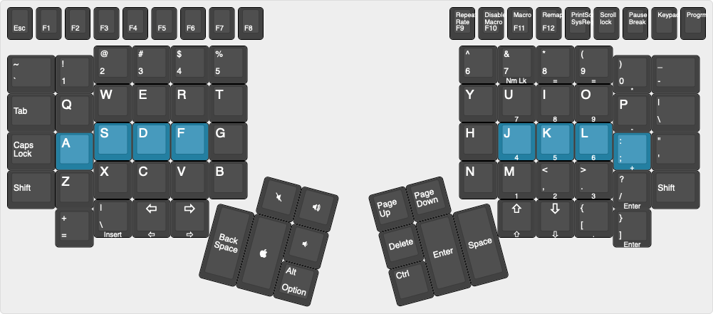

# Keyboards

This is a curated list of all my keyboards configurations.

After having tried regular keyboards, one of my friends introduced me to
incredible world of custom keyboards, DIY and split keyboard and ergonomic
customizations. Since then, I have been playing with keyboards, shortcuts and
new layouts to make life more interesting and fun on both regular and custom
setups.

## Dactyl

In `dactyl` folder contains configuration for the first split keyboard I have
ever tried. It was printed and soldered and put together by my friend, Robert
Snyder (@immeraufdemhund).

It had firmware flashed to it already. All I had to do was to use Via to upload
new layouts.

## Kinesis Advantage 2

Kinesis Advantage2 is the best keyboard I have ever tried. It has a bunch of
cool features and if you don't know what I am talking about, check out [their
website][1].

The kinesis folder contains configuration you upload the keyboard using, factory
controller via provided software, for both QWERTY and DVORAK.

For more info, check out Start Guides and other manuals on their [support
page][2].

## Mac

MacOS allows for some customization, but it's far from perfect to achieve good
ergonomics. Luckily for that task there is [Karabiner-Elements][3].

It is a powerful tool to do much more than just swapping Ctrl / CapsLock.

The `mac` folder contains Karabiner configuration.

## QMK

Well, now we're talking about something here.

QMK is the ultimate custom keyboard that creates firwmare for multiple types of
micro-controllers and allow infinite layouts and has an extensible API to create
complex keyboards setups.

Kinesis is a great keyboard and QMK (using custom hardware inside) gives it
really super powers. Check out [Michael Stapelberg's article][4] and [Youtube
video][5] about his `kinx` project with custom PCB + Teensy micro-controllers to
build a franken-keyboard that's awesome.

The `qmk` folder contains detailed instructions on how to setup qmk developement
environment, find the custom keymap, compile and flash it to the keyboard.

## Other resources

### Keyboard layout editor

[This website][6] allows us to create visualizations of keyboards layouts. It's
very useful to design visual representations of your layout specially if you're
practicing touch typing or even if you just want to show it off on the internet.

The `keyboard-layout.json` file is the metadata that can be uploaded to the
website to generate a representation of the keyboard.

This is how it looks like right now

### Kinesis Advantage 2

Other users' customizations to original Kinesis layouts for reference:

- https://github.com/farmergreg/kinesis-advantage-2
- http://xahlee.info/kbd/kinesis_keyboard_howto.html

### Inspiration and customizations

- https://twitter.com/i0exception/status/759083068103667713
- https://twitter.com/zkat__/status/732286911428083713
- https://twitter.com/TheMaxamillion/status/730067154133880832
- https://twitter.com/MobiWriter/status/768248621615632384
- https://twitter.com/kinesisergo/status/794618082727628800
- https://twitter.com/nrp_1/status/1326424789725089800
- https://twitter.com/TallWireless/status/1315742271162265611
- https://twitter.com/bradfitz/status/1281443582667153408
- https://twitter.com/ScooterPhoenix/status/1263872999574437895
- https://twitter.com/AgileinOrange/status/1113166072725684226

### Ergonomics

- https://twitter.com/treetopian/status/1306333723537833986

### Robin Williams on Flubber movie using a Kinesis keyboard

- https://twitter.com/pete_higgins/status/810956536004558849

[1]: https://kinesis-ergo.com/shop/advantage2/
[2]: https://kinesis-ergo.com/support/advantage2/
[3]: https://karabiner-elements.pqrs.org/
[4]: https://michael.stapelberg.ch/posts/tags/kinx/
[5]: https://www.youtube.com/watch?v=I0kwQbnhlfk
[6]: http://www.keyboard-layout-editor.com/
